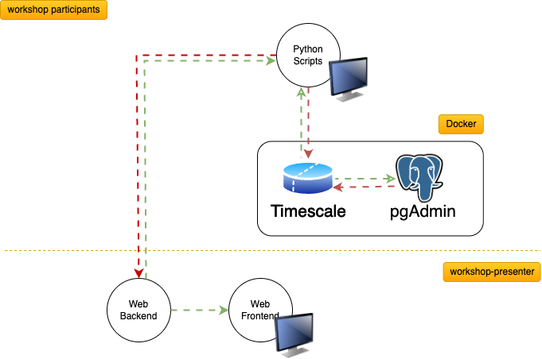
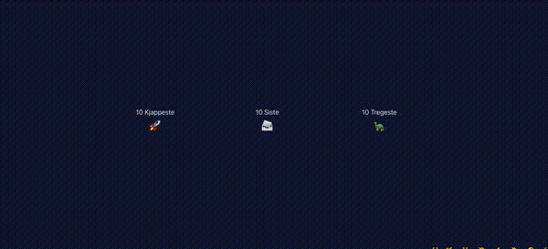
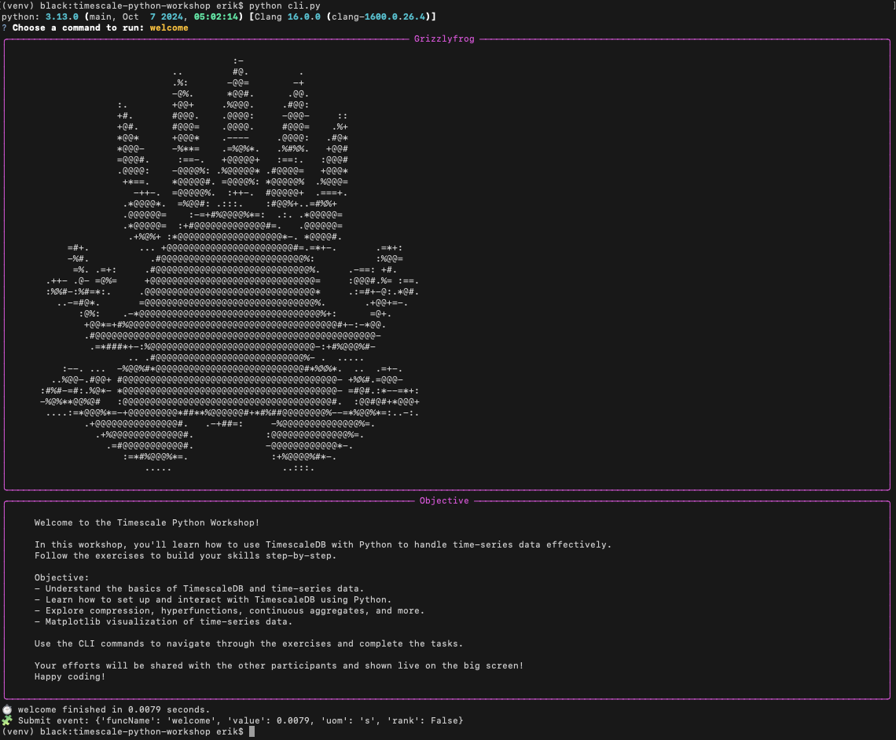

# 🚀 TimescaleDB + Python Workshop

**Competition time 🏆! Open the '.env' file, set your chosen name, and your workshop efforts will be shared on the big screen!**

This hands-on workshop will guide you through:

1. Fire up containers and connecting to a TimescaleDB database
2. Creating a 'sensors' hypertable
3. Inserting time-series data using `INSERT` statements
4. Ingesting time-series data using `COPY` statements
5. Setup compression on hypertables and compress historical data
6. Basic SQL queries
7. Use timescale hyperfunctions for time-series
8. Creating continuous aggregates for performance optimization

Utilities and helper scripts are provided to generate synthetic time-series data, monitor ingestion performance, and visualize query results. By using PgAdmin (or your favorite database tool), you can also explore the database and run queries to see the effects of your work.

## Workshop Infrastructure Overview



## Workshop Alternatives/Additions

### 1: SQL Only

If you prefer exploring TimescaleDB with SQL only, check out Timescale's own tutorials at [Timescale Tutorials](https://docs.tigerdata.com/tutorials/latest/). But that quickly gets boring! Alternativly, check out the [seed.sql](./solutions/seed.sql) file in this repository, which contains all the SQL commands needed to set up the database.

### 2: Real World Data

If you're familiar with TimescaleDB or prefer real-world data, download suitable [Kaggle](https://www.kaggle.com/datasets) datasets to experiment with analytics. Use your preferred tools for ingestion and analysis, leveraging TimescaleDB as the persistence layer.

Alternatively, modify Task 4 to ingest data from CSV files instead of the synthetic generator. Refer to [utils/disk.py](./utils/disk.py) for helper functions and mappers, or see the [kaggle bonus](./solutions/_09_ingest_kaggle_bonus/task.py) example, which plots a Kaggle Power Consumption dataset.

### 3: Workshop Event Stream (Useless real world data)

You can connect to [wss://workshop.grizzlyfrog.com](./utils/subscriber.py) to receive real-time events showing what everyone in the workshop is running — see if you can make something fun out of it! Or simply run `python cli.py ws-stream` to watch the stream live.



## ⚙️ Requirements

- Docker + Docker Compose
- Python 3.13.0+ (This workshop is tested with 3.13.0)
- `virtualenv` (optional but recommended)

## 📦 Installation

### 1. Install python dependencies:

```sh
# Create a virtual environment (optional but recommended)
# Use python3 if needed, or any other method you prefer to get you to run the pip install
python -m venv venv
source venv/bin/activate  # On Windows, perhaps use `venv\Scripts\activate` ?
pip install -r requirements.txt # This is the important step!
```

### 2. Verify installation by running:

```sh
python cli.py # Then choose welcome from the interactive menu

# Or fire up machine resource monitoring with a direct command

python cli.py monitor-machine
```

If it works, you should see something like this:



### 3. Start TimescaleDB and pgAdmin

In case you don't want to use pgAdmin, you can just remove the service from the `docker-compose.yml` file.

```sh
# Run terminal command from project root
docker-compose up -d
```

### 4. Start your first task: Setup & Connect

Follow the instructions in [tasks/\_01_setup/README.md](./tasks/_01_setup/README.md)

(But preferably read through this README first!)

#### Compose management commands

Unless you are using Docker Desktop or Podman Desktop GUI, here are some useful commands to manage the containers:

```sh
docker-compose ps          # list running containers
docker-compose logs -f     # follow logs
docker-compose down        # stop and remove containers
docker-compose restart     # restart containers
docker compose down -v     # stop and remove containers + volumes, in case you want a fresh start
```

## ⚡ Run the tasks

> ⚠️ Mind your terminal path!  
> Make sure your terminal path is at **_"timescale-python-workshop"_** root directory when running the commands below.

You can run your exercise tasks using predefined cli.py commands for simplicity (Recommended), otherwise, trigger the `task.py` files directly:

```sh
# Trigger a task method directly
python -m exercise._02_schema_hypertable.task
```

### 🚀 Cheat sheet for CLI commands

```sh
# Trigger a task through cli
python cli.py # Interactive mode,  choose task and action using arrow keys ⬆️ ⬇️
python cli.py --help    #  display help and available commands
python cli.py t6 --help # display help for specific task


python cli.py t1  # setup and connect
python cli.py t2  # create hypertable
python cli.py t3  # ingest data using INSERT
python cli.py t4  # ingest data using COPY
python cli.py t5  # compression
python cli.py t6  # basic queries
    python cli.py t6 plot_raw_all               # plot all data
    python cli.py t6 plot_average_all           # plot average data
    python cli.py t6 plot_custom                # Your custom query plot implementation
python cli.py t7  # hyperfunctions
   python cli.py t7 plot_downsampled_all        # plot downsampled data
   python cli.py t7 plot_average_all            # plot average data
   python cli.py t7 plot_histogram              # Your histogram implementation
python cli.py t8  # continuous aggregates
   python cli.py t8 init_cagg               # initialize continuous aggregate
   python cli.py t8 plot_all                # plot continuous aggregate data

# You can run solution versions of each task to compare performance and implementation, or skip ahead!
python cli.py s1  # solution for setup and connect
python cli.py s2  # solution for create hypertable
python cli.py s3  # solution for ingest data using INSERT
python cli.py s4  # solution for ingest data using COPY
python cli.py s5  # solution for compression
python cli.py s6  # solution for basic queries
   python cli.py s6 plot_raw_all               # plot all data
   python cli.py s6 plot_average_all           # plot average data
python cli.py s7  # solution for hyperfunctions
   python cli.py s7 plot_downsampled_all    # plot downsampled data
   python cli.py s7 plot_average_all        # plot average data
   python cli.py s7 plot_histogram          # plot histogram
python cli.py s8  # solution for continuous aggregates
   python cli.py s8 init_cagg               # initialize continuous aggregate
   python cli.py s8 plot_all                # plot continuous aggregate data
python cli.py bonus-kaggle
   python cli.py bonus-kaggle ingest_copy_kaggle_solution   # ingest kaggle data using COPY
   python cli.py bonus-kaggle plot_downsampled_all          # plot all of kaggle data
python cli.py ws-stream  # connect to workshop event stream and print events
```

## 📁 Workshop project structure

The exercise skeletons are located in the `tasks` folder. Each step has its own subfolder containing a `README.md` file with instructions and a `task.py` file where you will write your code. A few tasks have a `task.sql` file for better SQL syntax highlighting. The `utils` folder contains pre-defined helper functions, such as database connection handling, plot samples, data generation, websocket connection, and batch reading of CSV files. The `solutions` folder mirrors the `tasks` folder structure and contains reference implementations for each task.

```
timescale-python-workshop/
├─ README.md                   # This file
├─ docker-compose.yml          # TimescaleDB and PgAdmin services
├─ requirements.txt            # Python packages needed
├─ .env                        # DB creds for python (Yes, commited in git for workshop purposes)
├─ pytest.ini                  # Pytest configuration
├─ postgresql.base.conf        # Base config for TimescaleDB (docker-compose food)
├─ pgadmin.servers.json        # Links timescaledb service to pgadmin (docker-compose food)
├─ cli.py                      # Command line interface to run the exercise tasks, solutions and other utilities
├─ tasks/                   # You write your code in here (one folder per task)
│  ├─ 01_setup/
│  │  ├─ README.md
│  │  ├─ task.py                # participants edits here, but feel free to edit anything really
│  ├─ 02_schema_hypertable/
│  │  ├─ README.md
│  │  └─ task.py
│  │  └─ task.sql               # starter SQL for setting up timescale
│  ├─ 03_ingest_insert/
│  │  ├─ README.md
│  │  └─ task.py
│  ├─ 04_ingest_copy/
│  │  ├─ README.md
│  │  └─ task.py
│  ├─ 05_compression/
│  │  ├─ README.md
│  │  └─ task.py
│  ├─ 06_query_basics/
│  │  ├─ README.md
│  │  └─ task.py
│  ├─ 07_hyperfunctions/
│  │  ├─ README.md
│  │  └─ task.py
│  ├─ 08_continuous_aggregates/
│  │  ├─ README.md
│  │  └─ task.py
│  └─ ...
├─ solutions/                  # Mirrors src/steps/* (full reference with answers)
│  └─ 01_setup/
│     ├─ task_solution.py
│     └─ sql/
│  └─ ... (same tree as tasks)
└─ tests/                      # pytest checks for each of your implemented steps (Incomplete)
   ├─ test_02_schema_hypertable.py
   └─ ...
├─ utils/
│  │  ├─ db.py                 # get_connection() reads DSN from env
│  │  └─ generator.py          # helpers to generate sample data
│  │  └─ monitor.py            # helper to monitor table writes live
│  │  └─ plots.py              # helpers to plot data
│  │  └─ subscriber.py         # websocket subscriber to workshop event stream
│  │  └─ disk.py               # helpers to read CSV files in batches etc
   └─ ...
```

## 🛠️ Troubleshooting

Ask Erik for help! :)

Otherwise, it is a good idea to use pgAdmin or other tools to explore the database, tables, hypertables, and data as you progress through the tasks. You can also run SQL queries directly to verify your work and see the effects of your changes, or investigate any issues.

## ▶️ Verify your work by running tests (Deprecated)

There are no rights or wrongs in this workshop, only a lack of tests! ;)

```sh
# Run all tests
pytest

# Run single test file
pytest tests/test_02_schema_hypertable.py
```

## 🔗 Links and References

- [Docker](https://docs.docker.com/)
- [Python](https://www.python.org/doc/)
- [TimescaleDB API Reference](https://docs.tigerdata.com/api/latest/)
- [Columnar compression](https://www.tigerdata.com/blog/building-columnar-compression-in-a-row-oriented-database)
- [SQL Generate Realistic data](https://www.tigerdata.com/blog/generating-more-realistic-sample-time-series-data-with-postgresql-generate_series)
- [Building a Columnar Compression in a Row-Oriented Database](https://www.tigerdata.com/blog/building-columnar-compression-in-a-row-oriented-database)
- [Timescale + Grafana Tutorial](https://www.tigerdata.com/blog/get-started-with-timescale-and-grafana)
- [TimescaleDB Tutorials](https://docs.tigerdata.com/tutorials/latest/)
- [Timescale at Github: Tools and helper scripts](https://github.com/timescale)
- [PgAdmin Documentation](https://www.pgadmin.org/docs/pgadmin4/latest/)
- [Quality datasets for time-series data](https://www.kaggle.com/datasets)
