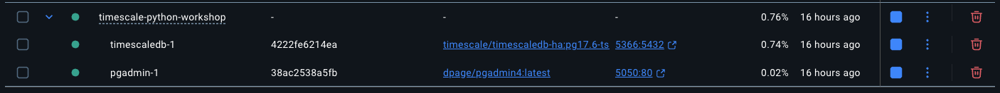
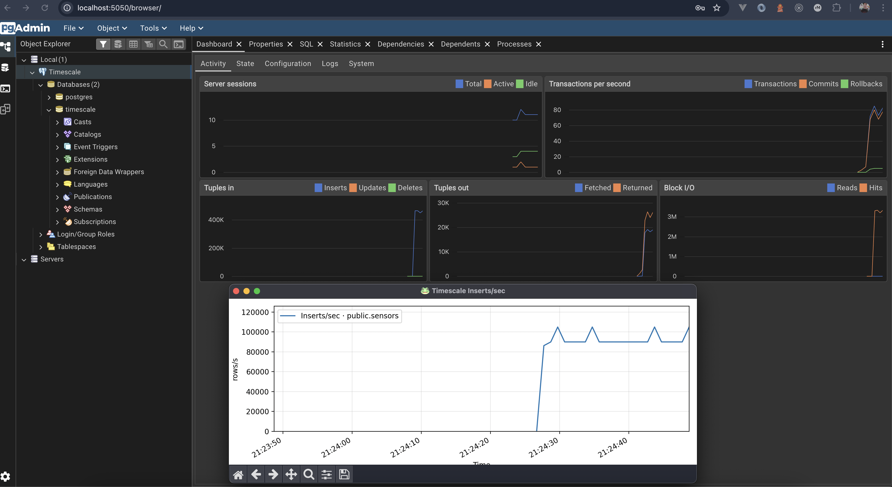
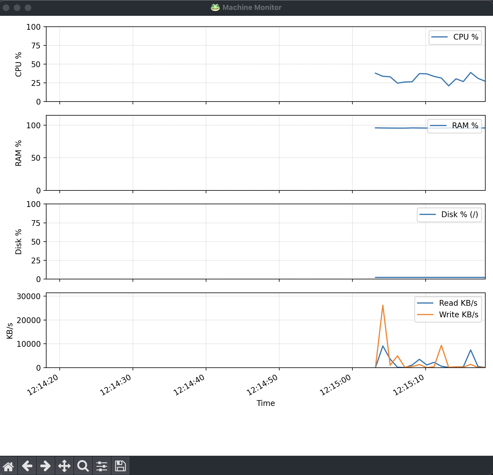

# Task 1 | ⚡ Setup & Connect

> 🧩 **Before you begin:**  
> Open the `.env` file and set the NAME variable to your name or nickname.  
> This will be used to identify your efforts on the workshop leaderboard.

## 🧱 Objective

In this task, you will:

- ✅ Verify that TimescaleDB and pgAdmin are running on your machine

- ✅ Ensure your Python environment is working and able to run the CLI (cli.py)

- ✅ Confirm that you can connect to TimescaleDB using both Python and pgAdmin

If anything isn’t working, follow the installation steps in the main [README.md](../../README.md#-installation).

Edit the [task.py](task.py) file and complete the `verify_connection()` function.  
Use the `get_connection()` function from `utils/db.py`.

## 🚀 Run the task

```sh
# Recommended for this workshop
python cli.py t1
# Or run the task file directly
python -m tasks._01_setup.task
```

## 💻 Example solution

```python
# Use the get_connection() function to connect to the database using DSN from environment variables
from utils.db import get_connection

conn = get_connection()
# Verify the connection
with conn.cursor() as cursor:
    cursor.execute("SELECT NOW();")
    print(cursor.fetchone())
```

## ✅ Verify

### Docker Containers



### pgAdmin

If pgAdmin is running via Docker Compose, access it at [http://localhost:5050](http://localhost:5050/)  
(default credentials: **username:** `timescaledb`, **password:** `password`).

pgAdmin helps visualize your database, run queries, and monitor activity.  
You’ll be prompted for a password on first connect.



### Python

You should be able to run this command after python requirements are installed:

```sh
# Monitor system resource usage
python cli.py monitor-machine
```

and see a screen like this:



## 🧰 About `utils` and `cli.py`

The `utils` folder contains helper functions for database connections, SQL execution, and plotting.  
Use these utilities to streamline your workflow — and feel free to extend them.

You can monitor system and database activity using `cli.py`:

```sh
# Monitor system resource usage
python cli.py monitor-machine

# (After Task 2)
python cli.py monitor-inserts
python cli.py table-count
python cli.py table-size
python cli.py table-chunks
python cli.py truncate-sensors
```

## 💡 Solution

An answer is already in this README, but you can find the reference solution is here 👉 [solutions/\_01_setup/task.py](../../solutions/_01_setup/task.py) for the sake of consistency.
