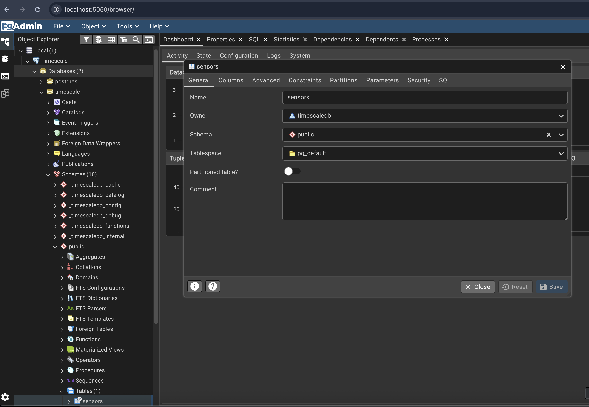

# Task 2 | 🛢️ Schema and Hypertable Setup

In this task, you will:

- ✅ Have completed [task 1](../_01_setup/README.md) - Setup & Connect to TimescaleDB

## 🧱 Objective

Create a **hypertable** to efficiently store time-series data.  
This involves defining the appropriate schema and setting up an index and partitioning.

Fill in the required SQL commands in the [task.sql](task.sql). The python logic in [task.py](task.py) already  
handles executing your SQL against the database.

### 🚀 Run the task

```sh
# Using the CLI
python cli.py t2

# Or run the task file directly
python -m tasks._02_schema_hypertable.task
```

## ✅ Verification

Use **pgAdmin** or run the following to confirm your hypertable was created successfully:

```sql
-- In pgAdmin or psql
SELECT *
FROM timescaledb_information.hypertables
WHERE hypertable_name = 'sensors';
```

Or check via CLI:

```sh
python cli.py table-size
```

## 🗄️ Hypertable Requirements

The hypertable must be named **`sensors`**, with the following schema:

```sql
 id INTEGER NOT NULL,
 time TIMESTAMPTZ NOT NULL,
 value DOUBLE PRECISION
```

- **`time`** → time dimension for the hypertable

- **`id`** → partitioning key to distribute data across chunks

- Add **indexes** on both `time` and `id` for optimal query performance

- Recommended **chunk time interval:** `7 days` (a safe default when ingestion patterns are unknown)  
  <br>

> ⚠️ **Do not add compression policies yet.**  
> Compression will be covered later in [task 5](../_05_compression/README.md). to clearly demonstrate its effects.

---

After completing this task, you should have a fully functional hypertable named **`sensors`** in your TimescaleDB instance — ready to efficiently handle time-series data.

If you have a specific use case in mind, feel free to add more columns as needed.  
You can also enable _chunk skipping_ for better query performance if relevant to your queries.

Refer to the official TimescaleDB documentation for details 👉 [Create Hypertable Documentation](https://docs.tigerdata.com/use-timescale/latest/hypertables/) or skip to the the solution file at [solution -> task.sql](../../solutions/_02_schema_hypertable/task.sql). But, it is nice to get familiar with the documentation.



## ✅ Test your solution

```sh
# Run automated tests
pytest tests/test_02_schema_hypertable.py

# Or simply check with CLI
python cli.py row-count
```

## 💡 Solution

Reference solution 👉 [solutions/\_02_schema_hypertable/task.sql](../../solutions/_02_schema_hypertable/task.sql)
