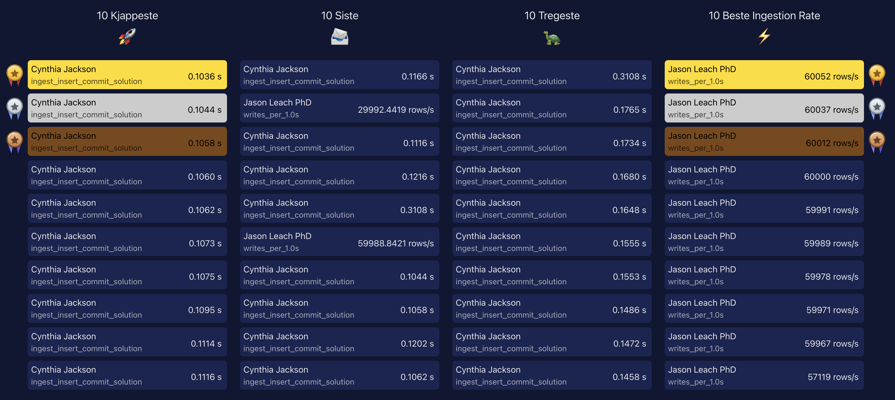

# Task 4 | 📦 Ingest Data using COPY

In this task, you will:

- ✅ Already have completed [Task 1](../_01_setup/README.md) and [Task 2](../_02_schema_hypertable/README.md).

- ✅ Have a `sensors` hypertable created in your TimescaleDB instance with columns `(id, time, value)`.

- ☑️ Truncate the `sensors` table if you have already ingested data in [Task 3](../_03_ingest_insert/README.md).

## 🧱 Objective

As in Task 3, you’ll ingest synthetic time-series data into the `sensors` hypertable —  
but this time using the **`COPY` command** instead of `INSERT`.

You’ll again observe and compare ingestion performance (rows per second).  
A working Python script is provided, and you can modify it to further improve performance.

## 🚀 Run the task

```sh
# Workshop exercise
python cli.py t4

# Compare with the solution version to see the performance difference
python cli.py s4
```

## 🧠 Evaluation

During ingestion, a **monitor window** will start automatically in a separate thread, displaying performance (rows per second) using PyPlot.  
Keep it running until ingestion completes or you stop it manually — your results will appear on the workshop leaderboard.



## ✅ Verification

Check your ingestion results in **pgAdmin** or via the **CLI**.

### Row count

```sql
-- Accurate but slow for large datasets
SELECT COUNT(*) FROM sensors;

-- Preferred: approximate and fast
SELECT approximate_row_count('sensors');
```

or

```sh
python cli.py table-count
```

### Hypertable size

```sql
SELECT pg_size_pretty(hypertable_size('sensors'));
-- Expected ≈ 2 GB after this task
```

or

```sh
python cli.py table-size
```

### Reset before rerun

```sql
TRUNCATE sensors;
```

or

```sh
python cli.py truncate-sensors
```

Then you can re-run the ingestion task as many times as needed.

## 💡 Solution

Reference solution 👉 [solutions/\_04_ingest_copy/task.py](../../solutions/_04_ingest_copy/task.py)
