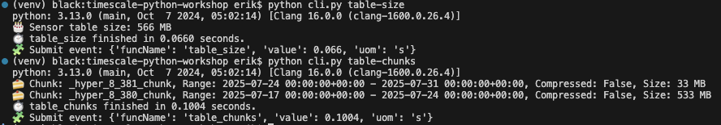
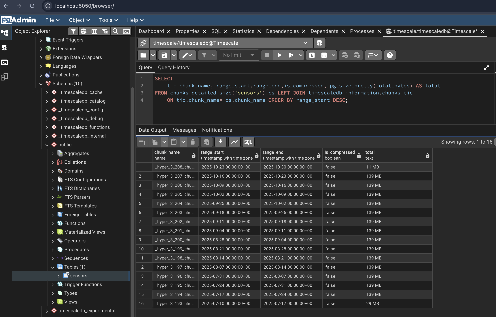
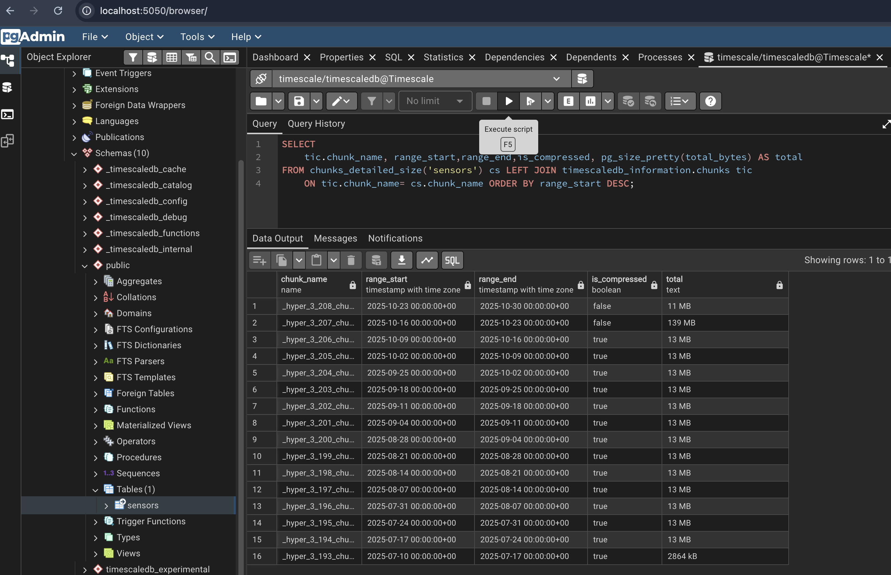

# Task 5 | 🗜️ Apply Compression

In this task, you will:

- ✅ Already have completed [Task 1](../_01_setup/README.md), [Task 2](../_02_schema_hypertable/README.md), and [Task 3](../_03_ingest_insert/README.md) or [Task 4](../_04_ingest_copy/README.md).

- ✅ Have a `sensors` hypertable created in your TimescaleDB instance with columns `(id, time, value)`.

- ✅ Have ingested a good amount of data into the `sensors` hypertable.

## 🧱 Objective

Apply **compression** to the `sensors` hypertable using TimescaleDB’s built-in features.  
Compression can greatly reduce storage requirements and improve query performance for large datasets.

Use the official documentation for reference:  
👉 [TimescaleDB Compression Documentation](https://docs.tigerdata.com/use-timescale/latest/compression/compression-policy/)

Create a **compression policy** that compresses chunks older than **7 days**.  
You can delay compression to observe the effects by setting an initial start time, for example:

```sql
initial_start => now() + '1 hour'::interval
```

<br>

> You’ll compare chunk stats before and after compression.  
> Continue with [Task 5 | 🗜️ Continued: After Compression](#task-5--️-continued-after-compression) once compression is applied.

## 🚀 Run the task

```sh
# Exercise version:
python cli.py t5

# Compare with the solution version (starts compression immediately):
python cli.py s5
```

## 🧠 Evaluation

Before and after compression, check the current chunk stats in pgAdmin:

```sql
SELECT
    tic.chunk_name, range_start,range_end,is_compressed, pg_size_pretty(total_bytes) AS total
FROM chunks_detailed_size('sensors') cs LEFT JOIN timescaledb_information.chunks tic
    ON tic.chunk_name= cs.chunk_name ORDER BY range_start DESC;
```

or use the CLI:

```sh
python cli.py table-chunks
```

Example output:



### Before Compression



### After Compression



## 🧩 About Timescale Policies

Create a **compression policy** for the `sensors` table.  
Policies are background jobs that automatically compress chunks matching the defined criteria.

You can monitor and manage these jobs using:

```sql
-- Check configured background jobs
SELECT * FROM timescaledb_information.jobs;

-- Check job statistics
SELECT * FROM timescaledb_information.job_stats;

-- Run a specific job manually
CALL run_job(1001);
```

## Task 5 | 🗜️ Continued: After Compression

After successfully applying compression, you should

- ✅ Verify that chunks are compressed.

- ✅ Re-run **Task 3** or **Task 4** to ingest a few more days of data

You’ll see that inserts into compressed chunks are possible but **reduce compression efficiency**.  
To manually recompress affected chunks:

```sql
CALL convert_to_rowstore('_timescaledb_internal.{chunk_name}');
CALL convert_to_columnstore('_timescaledb_internal.{chunk_name}');

-- OLD API (SUPPORTED BUT DEPRECATED)
--SELECT decompress_chunk('_timescaledb_internal.{chunk_name}');
--SELECT compress_chunk('_timescaledb_internal.{chunk_name}');

-- Example to recompress all chunks in the sensors hypertable. The function exists, but does not work as expected in our case. You might see a slight decrease in size, but not as much as if you decompress and compress again.
CALL recompress_hypertable_chunks('sensors');
CALL recompress_chunk('_timescaledb_internal._hyper_3_106_chunk');

```

## 💡 Solution

Not rocket science, but for consistency you can find the reference solution here 👉 [solutions/\_05_compression/task.sql](../../solutions/_05_compression/task.sql).
