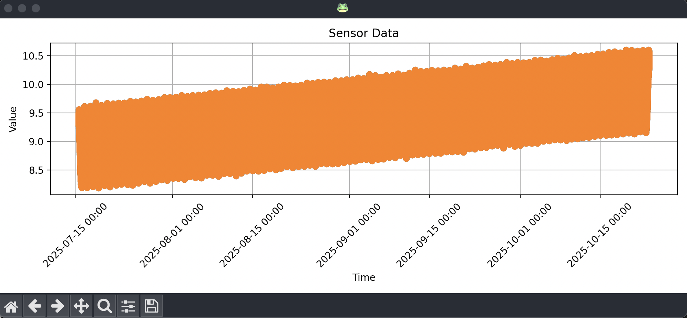

# Task 6 | 📈 Query Basics

In this task, you will:

- ✅ Already have completed [Task 1](../_01_setup/README.md), [Task 2](../_02_schema_hypertable/README.md), [Task 3](../_03_ingest_insert/README.md) or [Task 4](../_04_ingest_copy/README.md) and [Task 5](../_05_compression/README.md).

- ✅ Have a `sensors` hypertable created in your TimescaleDB instance with columns `(id, time, value)`.

- ✅ Have ingested a good amount of data into the `sensors` hypertable.

- ✅ Have applied compression and confirmed that your chunks are compressed.

## 🧱 Objective

Write **SQL queries** to retrieve and view data from the `sensors` hypertable.

The file [`task.py`](task.py) includes two predefined queries to get you started.  
You should also implement **one or more** of the following queries:

1. **Average Value Over Time** — calculate the average sensor value for a specific device over a defined time period (e.g., last 24 hours).

2. **Max/Min Value Retrieval** — get the maximum and minimum sensor values for a specific device within a time range.

3. **Data Aggregation** — aggregate data (e.g., hourly averages) for a specific device and visualize the results.

A placeholder function named `custom()` is provided in [`task.py`](task.py).  
Use it to build your own query logic, then visualize it via the corresponding CLI command, see [below](#-run-the-task)

> ⚠️ **Note:** Do _not_ use TimescaleDB hyperfunctions yet — that comes in the next task.  
> For now, stick to **standard SQL**.

## 🚀 Run the task

```sh
# Run the predefined queries
python cli.py t6 plot_raw_all
python cli.py t6 plot_average_all

# Run your custom query
python cli.py t6 plot_custom

# (Solution version is identical)
```

If you add new queries, create corresponding CLI functions in the [cli.py](../../cli.py) file, just follow the existing pattern.

> 💡 Tips  
> 👉 You can also just experiment freely with SQL directly in **pgAdmin**.

## 🧠 Evaluation

Visualizing _all_ raw data is messy — you’ll quickly see why filtering matters:



<br>

Try to identify and plot only meaningful values.  
💡 _Bonus points (and serious street cred) if you can do this using standard SQL only!_

Keep an eye on query execution times — efficient retrieval matters.

## 🛠️ Troubleshooting Tips

If your queries take too long or seem stuck, monitor and manage them with:

```sql
-- View all active queries
SELECT * FROM pg_stat_activity;

-- Find long-running ones (check the "query" and "pid" columns)
-- Then terminate them if needed:
SELECT pg_terminate_backend(<pid>);
```

## 💡 Solution

A reference solution is available here 👉 [solutions/\_06_query_basics/task.py](../../solutions/_06_query_basics/task.py) file.
