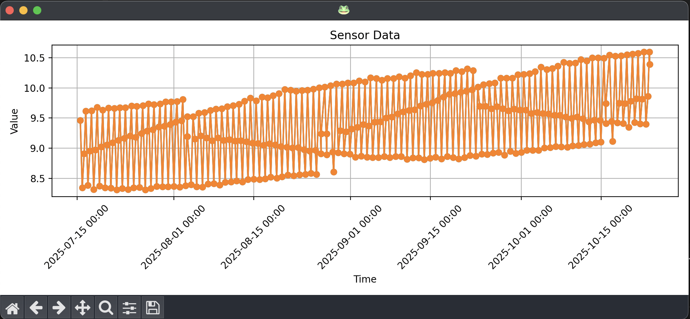

# Task 7 | 📈 Use Hyperfunctions

In this task, you will:

- ✅ Already have completed [Task 1](../_01_setup/README.md), [Task 2](../_02_schema_hypertable/README.md), [Task 3](../_03_ingest_insert/README.md) or [Task 4](../_04_ingest_copy/README.md) and [Task 5](../_05_compression/README.md).

- ✅ Have a `sensors` hypertable created in your TimescaleDB instance with columns `(id, time, value)`.

- ✅ Have ingested a good amount of data into the `sensors` hypertable.

- ✅ Have applied compression and confirmed that your chunks are compressed.

## 🧱 Objective

Explore **TimescaleDB Hyperfunctions** to analyze the `sensors` hypertable.  
Hyperfunctions provide powerful tools for time-series analysis such as **time bucketing**, **gap-filling**, and **downsampling**.

- Reference docs: 👉 [Hyperfunctions](https://docs.tigerdata.com/api/latest/hyperfunctions/)

A predefined **downsample** query is included in the code. Additionally, you should:

1. Implement the **[histogram](https://docs.tigerdata.com/api/latest/hyperfunctions/histogram/)** hyperfunction to visualize the distribution of sensor values over a specified range.  
   Adjust the min/max as needed for your data.

You can also explore one or more of:

2. **Time Bucketing** — aggregate data into fixed intervals (e.g., hourly averages)
3. **Gap-Filling** — fill missing timestamps to produce regular series for analysis/plotting

Downsampling is particularly useful to reduce data volume for processing and visualization.  
See 👉 [Downsampling docs](https://docs.tigerdata.com/api/latest/hyperfunctions/downsampling/).

> 💡 With **LTTB** (Largest-Triangle-Three-Buckets), you specify the number of output points. It’s ideal for plotting large datasets where the screen’s pixel width is the limiting factor.

## 🚀 Run the task

```sh
# Exercise version
python cli.py t7 plot_downsampled_all
python cli.py t7 plot_average_all
python cli.py t7 plot_histogram

# Solution (same as exercise), except histogram is implemented in the solution:
python cli.py s7 plot_histogram
```

If you add new queries, create corresponding CLI functions in the [cli.py](../../cli.py) file, just follow the existing pattern.

> 💡 Tips  
> 👉 You can also just experiment freely with hyperfunctions directly in **pgAdmin**.

## 🧠 Evaluation

We’re plotting the same data as in Task 6, but applying **LTTB** downsampling for cleaner visuals.  
Execution time should improve, and the data transferred is much lower—depending on your chosen resolution.  
How do you choose a good resolution? Start near your chart’s pixel width (or lower) and iterate.



Found any hyperfunctions that fit your real-world use case? Share your findings!

## 🛠️ Troubleshooting Tips

If queries run long or seem stuck, monitor/terminate them with:

```sql
-- View active queries
SELECT * FROM pg_stat_activity;

-- Identify long-running queries (see "query" and "pid"), then:
SELECT pg_terminate_backend(<pid>);
```

## 💡 Solution

Histogram implementation (and references) here 👉 [solutions/\_07_hyperfunctions/task.py](../../solutions/_07_hyperfunctions/task.py) file.
